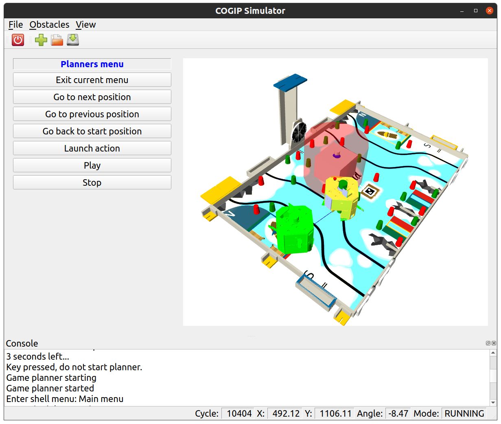

# Overview

The COGIP simulation project provides a set of simulation utilities developed by the COGIP robotic team.
It is used during development and debugging of its robot [firmware](https://github.com/cogip/mcu-firmware) and other test platforms.
This robot is developed for [Eurobot](https://www.eurobot.org/), French robotic contest.

## Tools

### Simulator

The simulator provides a graphical interface, featuring:

  * a 3D view of the table (in yellow) and the robot (in green)

  * a controller for the firmware compiled in native and calibration mode

  * a controller for the robot via serial port

  * a menu giving access to the firmware's calibration menu

  * a button to add obstacles (in grey), move and resize them

  * save and load obstacles using JSON files

  * visualization of ToF (red dots) and LIDAR (bleu dots) sensors detections

  * visualization of obstacles detected in the firmware (in transparent red)

  * charts window to visualize calibration data

### Replay

The replay tool is used to replay a game from a trace file.

### Lidar USB View

This tool displays a graphical view to render data provided by a HLS-LFCD2 Lidar connected to USB port.

### Lidar Platform View

Using the same interface as Lidar USB View, this tools displays Lida data provided by the real platform
through RIOT shell commands.
