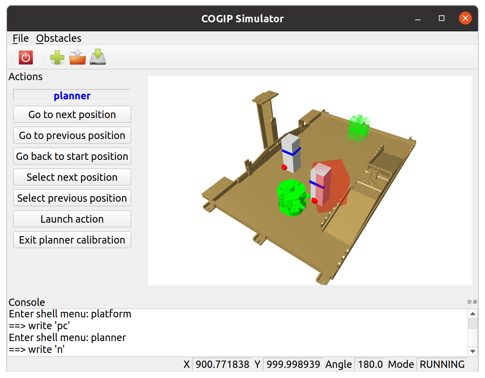

# Overview

The COGIP simulator is a tool developed by the COGIP robotic team.
It is used during development and debuging of its robot [firmware](https://github.com/cogip/mcu-firmware).
This robot is developed for [Eurobot](https://www.eurobot.org/), French robotic contest.

The simulator provides a graphical interface, featuring:

  * a 3D view of the table (in yellow) and the robot (in green)

  * a controller for the firmware compiled in native and calibration mode

  * a controller for the robot via serial port

  * a menu giving access to the firmware's calibration menu

  * a button to add obstacles (in grey), move and resize them

  * save and load obstacles using JSON files

  * visualization of ToF (red dots) and LIDAR (bleu dots) sensors detections

  * visualization of obstacles detected in the firmware (in transparent red)

