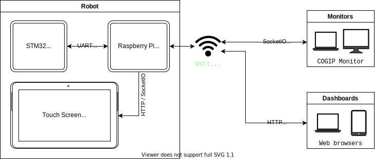

# Overview

The COGIP simulation project provides a set of Python utilities developed by the COGIP robotic team.
It is used during development, debugging and monitoring of its robot [firmware](https://github.com/cogip/mcu-firmware) and other test platforms.
This robot is developed for [Eurobot](https://www.eurobot.org/), French robotic contest.

The main component of the robot is a STM32 that runs [`mcu-firmware`](https://github.com/cogip/mcu-firmware). It is assiocated to a Raspberry Pi 4
that controls a camera, a touch screen. It runs the `Copilot` tool from this repository.

`mcu-firmware` (on STM32) and `Copilot` (on Raspberry Pi) communicate using Protobuf messages over a serial port.

`Copilot` is based on a web server, it provides a dashboard accessible with web browsers on the network.
It also provides a SocketIO server.
Monitoring tools like `Monitor` from this repository are connected to the SocketIO server.

`Copilot` received robot state and shell menus from `mcu-firmware` and emits SocketIO messages in JSON format to connected monitors.

Monitors can send commands to `Copilot` which forwards them to `mcu-firmware`.

The touchscreen displays the `Copilot` dashboard using an web browser embedded in the Raspberry Pi.

This repository also provides some tools to help debugging other robot components.
