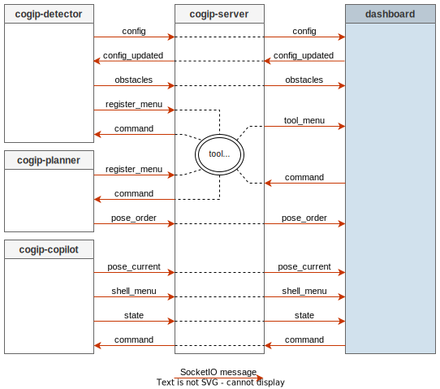

# Dashboard

The `Dashboard` is a web site displayed on the touchscreens
embedded in the robots.

The web server can also be accessed from any devices (PC, smartphones)
connected to the same network.

The web server listen on port `8080 + robot_id`, ie `8081` on robot 1.

## Data Flow

