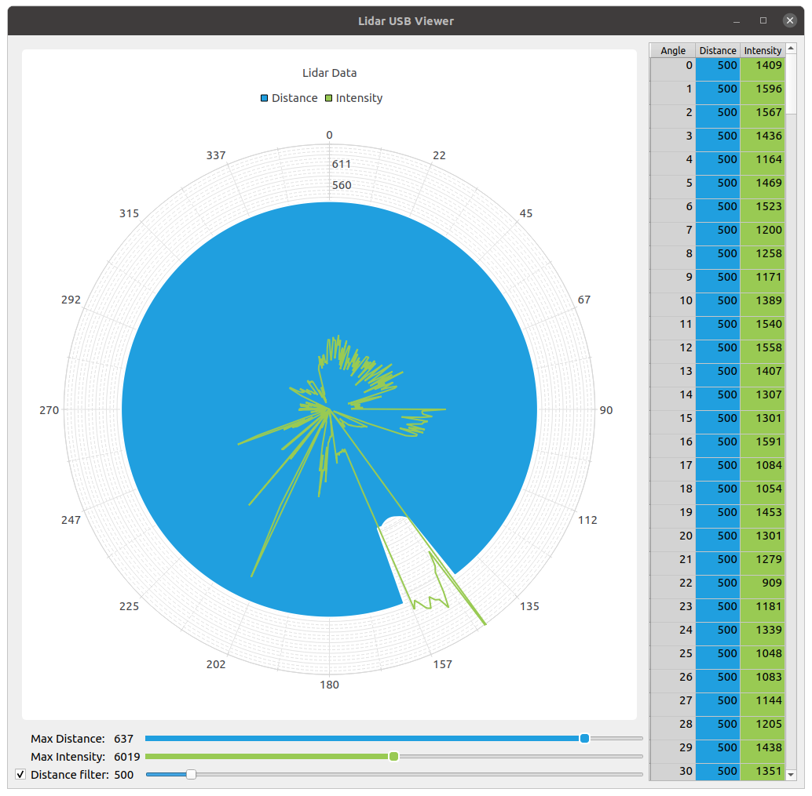

# Lidar Platform Viewer

Using the same interface as Lidar USB View, this tools displays Lida data provided by the real platform
through RIOT shell commands.

After installation (see [Install](../install.md)), the `Lidar Platform Viewer` is launched with:
```bash
$ cogip-lidarpf
```

The `Lidar Platform Viewer` requires a platform/robot connected via its serial port.
This plaform must have a Lidar and provide a shell with the following commands:

  - `start`: start the Lidar
  - `stop`: stop the Lidar
  - `set_filter <value>`: set the distance filter (in millimeters)
  - `data`: print Lidar data in JSON

By default, the serial ports are scanned, and if found, the first port will be used.

If the right USB port is not automatically detected, it can be specified using command line option.

## Command line options

```text
$ cogip-lidarpf --help
Usage: cogip-lidarpf [OPTIONS] [UART]

  Starts the Lidar Platform View tool.

Arguments:
  [UART]  The UART port to use  [default: (dynamic)]

Options:
  --install-completion [bash|zsh|fish|powershell|pwsh]
                                  Install completion for the specified shell.
  --show-completion [bash|zsh|fish|powershell|pwsh]
                                  Show completion for the specified shell, to
                                  copy it or customize the installation.

  --help                          Show this message and exit.
```
## Interface

The graphical interface provides a polar chart and table view.




### Polar Chart

Two kind of values are drawn on the chart:

- distance values for each degree (in millimeters)

- intensity values for each degree

Below the chart, the `Max Distance` and `Max Intensity` sliders allow to zoom
on the distance and intensity axes.

The `Distance filter` slider can be enabled/disabled using the checkbox.
If disabled, distance values displayed on the charts are raw data.
If enables, a filter is applied to drop corrupted values and
limit the detection to the maximum distance selected by the slider.

### Table

The table on the right of the window presents the same data as the chart but in numeric format.
