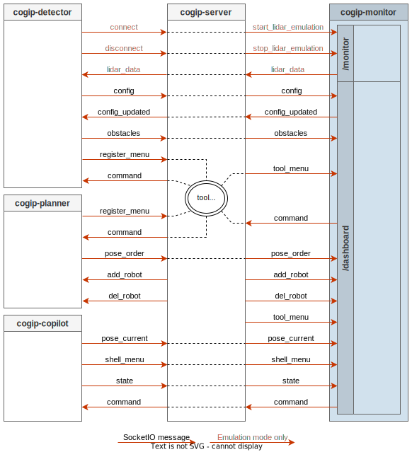

# Monitor

The `Monitor` is used to monitor the robot behavior during the game.

It communicates on the `/monitor` and `/dashboard` namespaces of the SocketIO server
running on the central beacon over Wifi.

Only one `Monitor` can be connected to the SocketIO server at the same time.

It can also provide fake Lidar data to `Detector` in emulation mode.

The monitor provides a graphical interface, featuring:

  * a 3D view of the table and the robot

  * a menu giving access to the planner menu and firmware's shell menu

  * a button to add obstacles (in grey), move and resize them

  * save and load obstacles using JSON files

  * visualization of ToF (red dots) and LIDAR (bleu dots) sensors detections

  * visualization of obstacles detected using the Lidar (in transparent red)

  * charts window to visualize calibration data

  * dashboard window to visualize the `Dashboard`

  * differents artifacts depending of current game rules


## Data Flow



## Run Monitor

To connect the `Monitor` to the `Server` running on the same development PC, run:

```bash
cogip-monitor http://localhost:8090
```

To connect the `Monitor` to the `Server` running on the Raspberry Pi
in the central beacon, run:

```bash
cogip-monitor http://cogip-beacon:8090
```

!!! note "Adapt URL and port depending on `Server` configuration"

## Command line options

```bash
$ cogip-monitor --help
Usage: cogip-monitor [URL]

  Launch COGIP Monitor.

Arguments:
  [URL]        Socket.IO Server URL
               env var: COGIP_SOCKETIO_SERVER_URL
               default: http://localhost:8090
```
